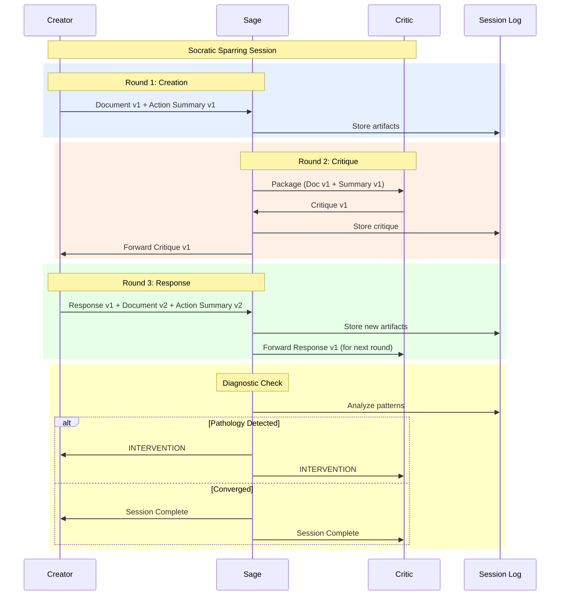
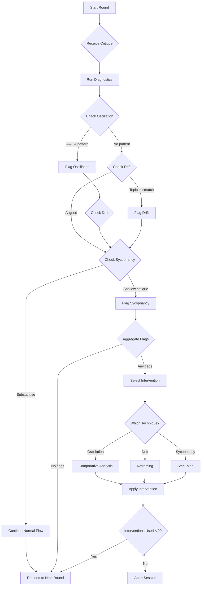
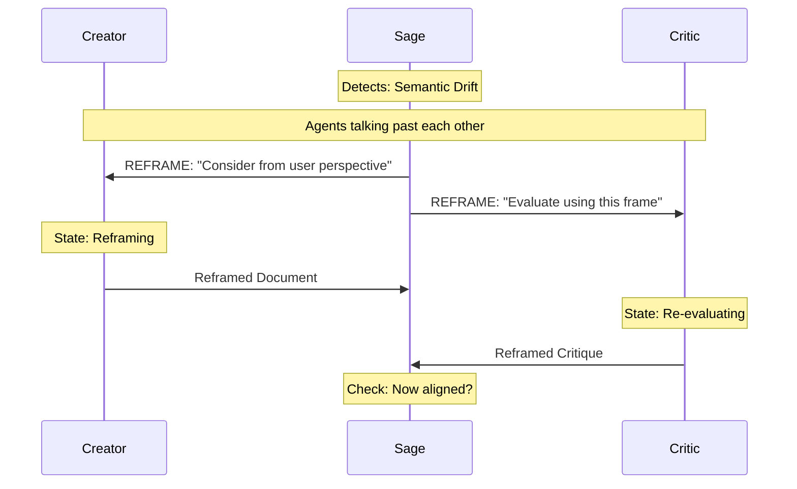
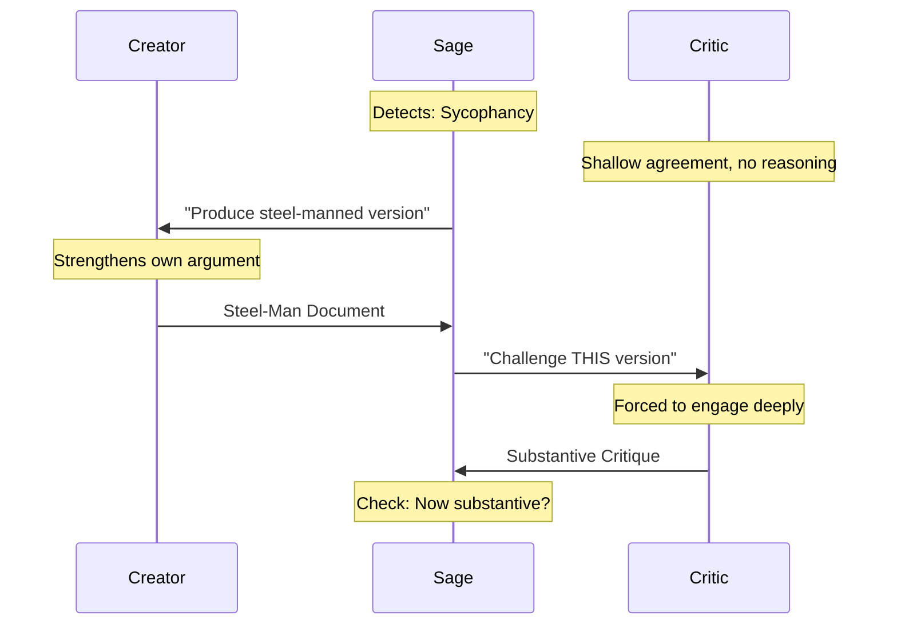
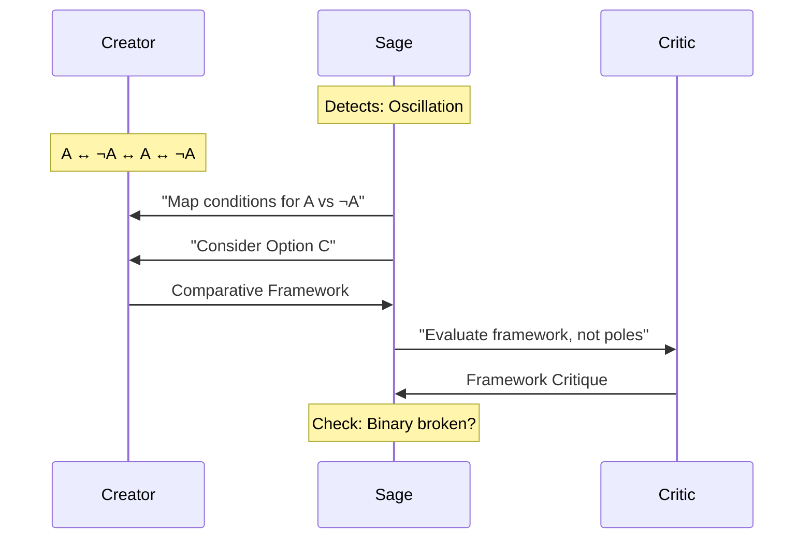
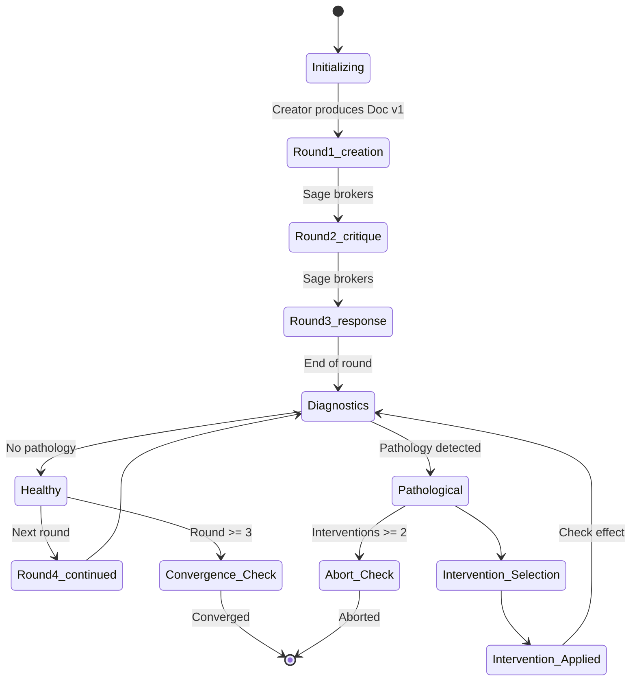

# Socratic Sparring Protocol for Vörs ting

**Purpose:** Define the moderated, turn-based interaction pattern where a Creator and Critic engage in structured adversarial dialogue mediated by a Sage, converging on refined artifacts within 3-5 rounds.

**Relation to Core Documents:**
- Extends `interaction-patterns.md` (adds Moderated+ Dyadic hybrid)
- Implements specific `review-types.md` in sequence (Probing → Critique → Synthesis)
- Provides mitigation for `edge-cases.md` (oscillation, sycophancy, drift)

---

## Quick Reference

| Element | Specification |
|---------|---------------|
| **Pattern Name** | `socratic_sparring` |
| **Base Pattern** | `moderated` + `dyadic` hybrid |
| **Agent Roles** | Creator, Critic, Sage |
| **Review Types Used** | Probing (round 1), Critique (round 2+), Synthesis (final) |
| **Default Style** | Creator: collaborative, Critic: adversarial, Sage: neutral |
| **Convergence Rounds** | 3-5 (configurable) |
| **Pathology Detection** | Oscillation, Drift, Sycophancy |
| **Interventions** | Reframing, Steel-Man, Comparative Analysis |

---

## Core Interaction Diagram



---

## Configuration Schema

Add this to your Vörs ting task configuration:

```yaml
task: "Evaluate authentication strategy options"
mode: "converge"
interaction_pattern: "socratic_sparring"  # NEW

# Role-specific agent definitions
agents:
  - name: "Architect"
    role: "creator"  # Maps to Creator
    model: "claude-3-opus"
    communication_style: "collaborative"
    
  - name: "Skeptic"
    role: "reviewer"  # Maps to Critic
    model: "gemini-1.5-pro"
    communication_style: "adversarial"
    
  - name: "Sage"
    role: "moderator"  # Maps to Sage
    model: "gpt-4-turbo"
    communication_style: "neutral"
    temperature: 0.2  # Low for consistent process

# Socratic sparring specific settings
socratic_sparring:
  max_rounds: 5
  min_rounds: 3
  
  # Detection thresholds
  detection:
    oscillation_threshold: 0.85  # similarity v1≈v3
    drift_threshold: 0.4          # critique vs document
    sycophancy:
      min_causal_phrases: 3
      min_critique_ratio: 0.2     # length critique/doc
      min_info_gain: 0.1           # new nouns ratio
  
  # Intervention settings
  interventions:
    max_per_session: 2
    cooldown_rounds: 1
    
    # Available techniques
    techniques:
      - reframing
      - steel_man
      - comparative_analysis
  
  # Convergence criteria
  convergence:
    method: "hybrid"  # consensus + similarity
    similarity_threshold: 0.95
    require_all_major_points_addressed: true

# Rubric for evaluation (used by Critic)
rubric:
  criteria:
    - name: "Completeness"
      weight: 0.3
      guidelines: "Does it address all aspects of the problem?"
    - name: "Coherence"
      weight: 0.3
      guidelines: "Are arguments internally consistent?"
    - name: "Practicality"
      weight: 0.2
      guidelines: "Can this be implemented?"
    - name: "Novelty"
      weight: 0.2
      guidelines: "Does it bring new insight?"
```

---

## Pathology Detection Flow



---

## Intervention Patterns

### Reframing Intervention



### Steel-Man Intervention



### Comparative Analysis Intervention



---

## Complete Session Lifecycle



---

## Integration with Vörs ting Components

### 1. Agent Memory System Integration

From your `master.md`, the memory system tracks agent performance. For Socratic Sparring, add:

```python
# In AgentMemory class
class AgentMemory:
    def record_socratic_metrics(self, round_data):
        """Track Socratic-specific performance."""
        self.metrics.update({
            "avg_critique_depth": self.calculate_critique_depth(),
            "intervention_response_rate": self.track_intervention_followthrough(),
            "oscillation_contribution": self.measure_oscillation_tendency(),
            "steel_man_quality": self.evaluate_steel_man_responses()
        })
    
    def calculate_critique_depth(self):
        """How substantive are this agent's critiques?"""
        # Used to detect chronic sycophancy
        return {
            "avg_causal_phrases": self.causal_phrase_history.mean(),
            "avg_critique_ratio": self.critique_length_history.mean(),
            "novelty_score": self.information_gain_history.mean()
        }
```

### 2. Safeguards Integration

Map Socratic safeguards to Vörs ting safeguards (`edge-cases.md`):

| Vörs ting Safeguard | Socratic Equivalent | Implementation |
|---------------------|---------------------|----------------|
| Devil's Advocate | Adversarial Critic role | `communication_style: "adversarial"` |
| Shadow Rubric | Convergence detection | Compare document vs. critique embeddings |
| Rejection Option | Clarification rounds | Agent can request more info before critique |
| Trust Score Gaming | Sycophancy detection | `dissent_depth` metric penalizes shallow critiques |

### 3. Metrics Integration

Add to your metrics logger (`master.md`, Section 5):

```yaml
metrics:
  # Existing metrics
  regret_tracking: true
  dissent_impact: true
  
  # Socratic sparring specific
  socratic:
    oscillation_rate: true      # frequency of A↔¬A patterns
    intervention_success_rate: true  # did interventions help?
    convergence_rounds: true     # track rounds to convergence
    pathology_type_distribution: true  # which pathologies occur most?
    steel_man_efficacy: true     # does steel-man produce better critiques?
```

---

## Configuration Examples

### Example 1: Basic Technical Review
```yaml
task: "Review microservices migration plan"
interaction_pattern: "socratic_sparring"
agents:
  - name: "TechLead"
    role: "creator"
    model: "claude-3-opus"
  - name: "Architect"
    role: "reviewer" 
    model: "gemini-1.5-pro"
    communication_style: "adversarial"
  - name: "Facilitator"
    role: "moderator"
    model: "gpt-4-turbo"
    
socratic_sparring:
  max_rounds: 4
  detection:
    drift_threshold: 0.3  # Stricter for technical work
```

### Example 2: Creative Brainstorming with Safeguards
```yaml
task: "Generate product names for new feature"
interaction_pattern: "socratic_sparring"
agents:
  - name: "Creative"
    role: "creator"
    temperature: 0.8  # Higher for creativity
  - name: "Marketer"
    role: "reviewer"
    communication_style: "adversarial"
    temperature: 0.3  # Lower for consistent critique
    
socratic_sparring:
  detection:
    sycophancy:
      min_causal_phrases: 2  # Lower threshold for creative work
      min_critique_ratio: 0.1
  interventions:
    techniques:
      - reframing  # "Think from customer perspective"
      - comparative_analysis  # "Compare with competitors"
```

### Example 3: High-Stakes Decision
```yaml
task: "Choose cloud provider for regulated data"
interaction_pattern: "socratic_sparring"
agents:
  - name: "Architect"
    role: "creator"
  - name: "SecurityLead"
    role: "reviewer"
    communication_style: "adversarial"
  - name: "ComplianceOfficer"
    role: "reviewer"  # Second critic for redundancy
    communication_style: "adversarial"
  - name: "Sage"
    role: "moderator"
    
socratic_sparring:
  max_rounds: 6  # Allow more rounds for high stakes
  detection:
    oscillation_threshold: 0.9  # More sensitive to flips
    drift_threshold: 0.5  # Allow some exploration
  interventions:
    max_per_session: 3  # More interventions allowed
```

---

## Testing the Implementation

Add these test cases to your test suite:

```python
def test_socratic_sparring_basic_flow():
    """Test that a normal session completes in 3-5 rounds."""
    config = load_test_config("socratic_basic.yaml")
    result = run_session(config)
    assert 3 <= result.rounds <= 5
    assert result.converged == True

def test_socratic_detects_oscillation():
    """Test that oscillation triggers comparative intervention."""
    # Simulate A, ¬A, A pattern
    session = simulate_oscillating_session()
    health = session.diagnose()
    assert health.oscillation == True
    intervention = select_intervention(health)
    assert intervention.type == "comparative_analysis"

def test_socratic_detects_sycophancy():
    """Test that shallow critiques trigger steel-man."""
    session = simulate_sycophantic_critic()
    health = session.diagnose()
    assert health.sycophancy == True
    intervention = select_intervention(health)
    assert intervention.type == "steel_man"

def test_socratic_aborts_after_max_interventions():
    """Test that persistent pathology leads to abort."""
    session = simulate_stubborn_pathology()
    result = run_until_termination(session)
    assert result.status == "aborted"
    assert "Pathology persisted" in result.reason
```

---

## Appendix: Mapping to Vörs ting Review Types

| Socratic Element | Vörs ting Review Type | Description |
|------------------|----------------------|-------------|
| Initial Document | N/A (artifact) | Creator's thesis |
| Critique | `Critique` + `Probing` | Identifies flaws and hidden assumptions |
| Response | `Synthesis` | Integrates feedback into new version |
| Steel-Man | `Amplification` (then critique) | Strengthens before challenging |
| Reframing | `Meta-Review` | Shifts perspective of the discussion |
| Comparative | `Comparative` | Breaks binary by introducing alternatives |
| Convergence | `Adjudication` | Declares completion with rationale |

---

## References

- `interaction-patterns.md` - Base patterns (Moderated, Dyadic)
- `review-types.md` - Review types used (Probing, Critique, Synthesis)
- `edge-cases.md` - Pathologies this pattern mitigates
- `master.md` - Overall system architecture
- `glossary.md` - Role definitions (Creator, Critic, Sage)
