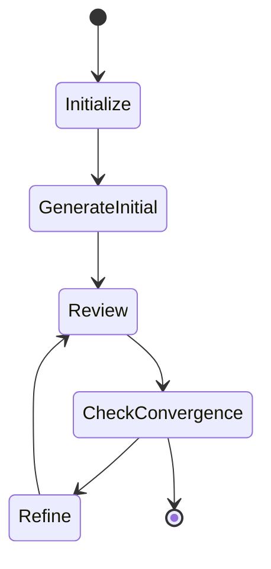

# Migration Guide: LiteLLM → Pydantic AI (with optional Pydantic Graph)

This guide documents the migration from LiteLLM to Pydantic AI for the Vörs ting multi-agent framework.

**Status:** Planned  
**Estimated Effort:** 1-2 days (Phases 1-9), +1 day (Phase 10 - Pydantic Graph)  
**Impact:** All agent classes, orchestrator, and tests

> **Note:** This guide covers two levels of migration:
> 1. **Phases 1-9:** Core migration to pydantic-ai (recommended for all users)
> 2. **Phase 10:** Optional migration to pydantic-graph for advanced orchestration (consider if you need resumable runs, human-in-the-loop, or visual workflows)

---

## Why Migrate?

| Capability | LiteLLM (Current) | Pydantic AI (Target) |
|------------|-------------------|----------------------|
| Structured Output | Manual string parsing | Pydantic-validated models |
| Retry Logic | 60 lines custom code | `retries=3` parameter |
| Type Safety | `dict[str, Any]` | Generic `Agent[Deps, Output]` |
| Async Support | Sync only | Native async + parallelism |
| Testing | Mock `completion()` calls | Inject `TestModel` |
| Observability | Print statements | OpenTelemetry tracing |
| Reflection | Not implemented | Auto-retry on validation failure |

---

## Architecture Changes

### Before (LiteLLM)

```
Orchestrator → BaseAgent._call_llm() → litellm.completion()
                                    ↓
                              Manual retry logic (60 lines)
                                    ↓
                              String response parsing
```

### After (Pydantic AI)

```
Orchestrator → BaseAgent._agent.run() → Pydantic AI Agent
                                    ↓
                              Built-in retries + reflection
                                    ↓
                              Validated Pydantic output
```

---

## Migration Phases

### Phase 1: Dependencies

**File:** `pyproject.toml`

```toml
[project]
dependencies = [
-   "litellm>=1.0",
+   "pydantic-ai>=0.0.50",
    # ... rest unchanged
]
```

Run:
```bash
uv sync
```

---

### Phase 2: Structured Output Schemas

**New File:** `src/vors_ting/agents/schemas.py`

Create Pydantic models for agent outputs:

```python
"""Structured output schemas for agents."""

from pydantic import BaseModel, Field


class ReviewResult(BaseModel):
    """Structured output from reviewer agents."""
    
    feedback: str = Field(description="Detailed constructive feedback")
    clarity_score: int = Field(ge=1, le=10, description="Clarity rating")
    completeness_score: int = Field(ge=1, le=10, description="Completeness rating")
    security_concerns: list[str] = Field(
        default_factory=list, 
        description="Any security issues identified"
    )
    
    @property
    def overall_score(self) -> float:
        """Calculate overall weighted score."""
        return (self.clarity_score + self.completeness_score) / 2


class GenerationResult(BaseModel):
    """Structured output from creator agents."""
    
    content: str = Field(description="Generated content")
    confidence: int = Field(ge=1, le=10, description="Confidence in the generation")
    citations: list[str] = Field(
        default_factory=list,
        description="Any sources or references used"
    )
```

---

### Phase 3: BaseAgent Refactor

**File:** `src/vors_ting/agents/base.py`

Replace manual LLM calling with Pydantic AI Agent:

```python
"""Base agent class for Vörs ting."""

from abc import ABC, abstractmethod
from typing import Any, TypeVar

from pydantic_ai import Agent

T = TypeVar("T")


class BaseAgent(ABC):
    """Abstract base class for all agents."""

    def __init__(
        self,
        name: str,
        role: str,
        model: str,
        provider: str | None,
        temperature: float = 0.2,
        system_prompt: str | None = None,
    ) -> None:
        """Initialize the agent."""
        self.name: str = name
        self.role: str = role
        self.model: str = model
        self.provider: str | None = provider
        self.temperature: float = temperature
        self.system_prompt: str | None = (
            system_prompt or self._get_default_system_prompt()
        )
        # Create underlying Pydantic AI agent
        self._agent: Agent = self._create_agent()

    def _create_agent(self) -> Agent:
        """Create the Pydantic AI agent instance."""
        model_str = f"{self.provider}:{self.model}" if self.provider else self.model
        
        return Agent(
            model=model_str,
            system_prompt=self.system_prompt or self._get_default_system_prompt(),
            retries=3,  # Built-in retry with reflection
        )

    def _get_default_system_prompt(self) -> str:
        """Get the default system prompt based on agent role."""
        prompts = {
            "creator": (
                "You are a creative expert. Generate high-quality content "
                "based on the task."
            ),
            "reviewer": (
                "You are a critical reviewer. Evaluate content objectively "
                "and provide constructive feedback."
            ),
            "curator": (
                "You are a curator. Organize and synthesize diverse ideas "
                "into coherent clusters."
            ),
        }
        return prompts.get(self.role, "You are a helpful assistant.")

    async def _call_llm(
        self, 
        prompt: str, 
        output_type: type[T] | None = None
    ) -> str | T:
        """Call the LLM with optional structured output.
        
        Args:
            prompt: The prompt to send to the LLM
            output_type: Optional Pydantic model for structured output
            
        Returns:
            String response or validated Pydantic model instance
        """
        result = await self._agent.run(
            prompt, 
            output_type=output_type,
        )
        return result.output

    @abstractmethod
    async def generate(
        self, task: str, context: dict[str, Any] | None = None
    ) -> str:
        """Generate content based on the task."""

    @abstractmethod
    async def review(
        self, content: str, rubric: dict[str, Any] | None = None
    ) -> Any:
        """Review content and provide feedback."""

    @abstractmethod
    async def refine(self, original: str, feedback: dict[str, Any]) -> str:
        """Refine content based on feedback."""

    def reject(self, reason: str) -> dict[str, Any]:
        """Reject the task with a reason."""
        return {"status": "rejected", "reason": reason}
```

**Key Changes:**
- Remove 60 lines of manual retry logic
- Remove `RateLimitError` handling (built into Pydantic AI)
- Remove manual response parsing
- Make methods `async`
- Add `output_type` parameter for structured outputs

---

### Phase 4: ReviewerAgent Update

**File:** `src/vors_ting/agents/reviewer.py`

```python
"""Reviewer agent implementation."""

from typing import Any, override

from vors_ting.agents.schemas import ReviewResult

from .base import BaseAgent


class ReviewerAgent(BaseAgent):
    """Agent that reviews content with structured output."""

    def _build_review_prompt(
        self, content: str, rubric: dict[str, Any] | None = None
    ) -> str:
        """Build the review prompt."""
        prompt = f"Review the following content:\n\n{content}"
        if rubric:
            prompt += f"\n\nEvaluation rubric: {rubric}"
        prompt += (
            "\n\nProvide detailed feedback and scores. "
            "Be specific about clarity, completeness, and any security concerns."
        )
        return prompt

    @override
    async def generate(
        self, task: str, context: dict[str, Any] | None = None
    ) -> str:
        """Generate content (reviewers can also generate if needed)."""
        prompt = f"Task: {task}"
        if context:
            prompt += f"\n\nContext: {context}"
        prompt += "\n\nPlease generate content:"
        
        return await self._call_llm(prompt)  # type: ignore

    @override
    async def review(
        self, content: str, rubric: dict[str, Any] | None = None
    ) -> ReviewResult:
        """Review content and return structured feedback."""
        prompt = self._build_review_prompt(content, rubric)
        
        # Structured output - validated automatically by Pydantic AI
        result = await self._call_llm(prompt, output_type=ReviewResult)
        return result  # type: ignore

    @override
    async def refine(self, original: str, feedback: dict[str, Any]) -> str:
        """Refine content based on feedback."""
        prompt = f"Original content:\n\n{original}"
        prompt += f"\n\nFeedback received:\n\n{feedback}"
        prompt += "\n\nPlease refine the content based on this feedback:"
        
        return await self._call_llm(prompt)  # type: ignore
```

---

### Phase 5: CreatorAgent Update

**File:** `src/vors_ting/agents/creator.py`

```python
"""Creator agent implementation."""

from typing import Any, override

from vors_ting.agents.schemas import GenerationResult

from .base import BaseAgent


class CreatorAgent(BaseAgent):
    """Agent that generates content."""

    def _build_generation_prompt(
        self, task: str, context: dict[str, Any] | None = None
    ) -> str:
        """Build the generation prompt."""
        prompt = f"Task: {task}"
        if context:
            prompt += f"\n\nContext: {context}"
        prompt += "\n\nPlease generate high-quality content:"
        return prompt

    def _build_refinement_prompt(
        self, original: str, feedback: dict[str, Any]
    ) -> str:
        """Build the refinement prompt."""
        prompt = f"Original content:\n\n{original}"
        prompt += f"\n\nFeedback received:\n\n{feedback}"
        prompt += "\n\nPlease refine the content based on this feedback:"
        return prompt

    @override
    async def generate(
        self, task: str, context: dict[str, Any] | None = None
    ) -> str:
        """Generate content based on the task."""
        prompt = self._build_generation_prompt(task, context)
        result = await self._call_llm(prompt, output_type=GenerationResult)
        return result.content  # type: ignore

    @override
    async def review(
        self, content: str, rubric: dict[str, Any] | None = None
    ) -> dict[str, Any]:
        """Review content as a creator (peer review)."""
        prompt = f"Review the following content:\n\n{content}"
        if rubric:
            prompt += f"\n\nEvaluation rubric: {rubric}"
        prompt += "\n\nProvide constructive feedback and scores:"

        response = await self._call_llm(prompt)
        return {"feedback": response, "scores": {}}

    @override
    async def refine(self, original: str, feedback: dict[str, Any]) -> str:
        """Refine content based on feedback."""
        prompt = self._build_refinement_prompt(original, feedback)
        result = await self._call_llm(prompt, output_type=GenerationResult)
        return result.content  # type: ignore
```

---

### Phase 6: CuratorAgent Update

**File:** `src/vors_ting/agents/curator.py`

```python
"""Curator agent implementation."""

from typing import Any, override

from .base import BaseAgent


class CuratorAgent(BaseAgent):
    """Agent that curates and organizes content."""

    @override
    async def generate(
        self, task: str, context: dict[str, Any] | None = None
    ) -> str:
        """Generate curated content."""
        prompt = f"Curate and organize the following: {task}"
        if context:
            prompt += f"\n\nContext: {context}"
        return await self._call_llm(prompt)  # type: ignore

    @override
    async def review(
        self, content: str, rubric: dict[str, Any] | None = None
    ) -> dict[str, Any]:
        """Review content organization."""
        prompt = f"Review the organization of:\n\n{content}"
        response = await self._call_llm(prompt)
        return {"feedback": response, "scores": {}}

    @override
    async def refine(self, original: str, feedback: dict[str, Any]) -> str:
        """Refine organization based on feedback."""
        prompt = f"Original:\n\n{original}\n\nFeedback: {feedback}"
        return await self._call_llm(prompt)  # type: ignore

    async def cluster_ideas(self, ideas: list[str]) -> list[list[str]]:
        """Cluster similar ideas together."""
        prompt = f"Cluster these ideas into related groups:\n\n"
        for i, idea in enumerate(ideas, 1):
            prompt += f"{i}. {idea}\n"
        prompt += "\nReturn the clusters as groups of numbers."
        
        response = await self._call_llm(prompt)
        # Parse clustering response (simplified)
        return [[ideas[0]]] if ideas else []
```

---

### Phase 7: Orchestrator Async Update

**File:** `src/vors_ting/orchestration/orchestrator.py`

Key changes for async support and parallel execution:

```python
"""Main orchestrator for Vörs ting."""

import asyncio
from typing import Any

from vors_ting.agents.schemas import ReviewResult


class Orchestrator:
    """Main orchestrator that manages the feedback loop."""

    async def run(self) -> dict[str, Any]:
        """Run the feedback loop asynchronously."""
        result: dict[str, Any] = {}
        try:
            if self.config.mode == "converge":
                result = await self._run_converge_mode()
            else:
                result = await self._run_diverge_mode()
        except Exception:
            await self._auto_save()
            raise
        else:
            await self._auto_save()
        return result

    async def _run_converge_mode(self) -> dict[str, Any]:
        """Run the convergence mode asynchronously."""
        self.initialize_agents()
        
        # Round 0: Initial generation
        initial_artifacts = await self._initial_generation()
        
        # Subsequent rounds
        for round_num in range(1, self.config.rounds + 1):
            self.current_round = round_num
            
            # Review phase (parallel)
            reviews = await self._review_phase(initial_artifacts)
            
            # Refine phase (parallel)
            refined_artifacts = await self._refine_phase(initial_artifacts, reviews)
            
            # Check convergence
            if self._check_convergence(initial_artifacts, refined_artifacts):
                return {"status": "converged", "artifacts": refined_artifacts}
            
            initial_artifacts = refined_artifacts
        
        return {"status": "max_rounds_reached", "artifacts": initial_artifacts}

    async def _initial_generation(self) -> list[str]:
        """Generate initial artifacts in parallel."""
        tasks = []
        for agent in self.agents:
            if agent.role == "creator":
                task = agent.generate(self.config.task)
                tasks.append(task)
        
        return await asyncio.gather(*tasks)

    async def _review_phase(
        self, artifacts: list[str]
    ) -> list[ReviewResult]:
        """Perform the review phase in parallel."""
        tasks = []
        rubric = self.config.rubric.model_dump() if self.config.rubric else None
        
        for artifact in artifacts:
            for agent in self.agents:
                if agent.role == "reviewer":
                    task = agent.review(artifact, rubric)
                    tasks.append(task)
        
        results = await asyncio.gather(*tasks, return_exceptions=True)
        
        # Filter out exceptions
        valid_reviews: list[ReviewResult] = []
        for r in results:
            if isinstance(r, Exception):
                self._log(f"Review failed: {r}", style="red")
            else:
                valid_reviews.append(r)
        
        return valid_reviews

    async def _refine_phase(
        self, artifacts: list[str], reviews: list[ReviewResult]
    ) -> list[str]:
        """Perform the refinement phase in parallel."""
        tasks = []
        
        for i, artifact in enumerate(artifacts):
            # Get relevant reviews for this artifact
            artifact_reviews = [
                reviews[j] for j in range(i, len(reviews), len(artifacts))
            ]
            
            for agent in self.agents:
                if agent.role == "creator":
                    task = agent.refine(
                        artifact, 
                        {"reviews": [r.model_dump() for r in artifact_reviews]}
                    )
                    tasks.append(task)
                    break  # Only one creator per artifact
        
        return await asyncio.gather(*tasks)
```

---

### Phase 8: CLI Entry Point Update

**File:** `src/vors_ting/cli.py`

Add `asyncio.run()` wrapper:

```python
"""CLI for Vörs ting."""

import asyncio
from pathlib import Path

import typer
from vors_ting.core.config import load_config
from vors_ting.orchestration.orchestrator import Orchestrator

app = typer.Typer()


@app.command()
def run(
    config_path: Path = typer.Argument(..., help="Path to YAML config"),
    quiet: bool = typer.Option(False, "--quiet", "-q", help="Suppress output"),
) -> None:
    """Run Vörs ting with the specified configuration."""
    config = load_config(config_path, verbose=not quiet)
    orchestrator = Orchestrator(config, quiet=quiet)
    
    # Run async orchestrator
    result = asyncio.run(orchestrator.run())
    
    # Print result summary
    if not quiet:
        typer.echo(f"\nFinal status: {result['status']}")
        typer.echo(f"Artifacts: {len(result['artifacts'])}")


if __name__ == "__main__":
    app()
```

---

### Phase 9: Test Updates

**File:** `tests/test_agents.py`

Use `TestModel` for deterministic testing:

```python
"""Tests for agents."""

import pytest
from pydantic_ai.models.test import TestModel

from vors_ting.agents.creator import CreatorAgent
from vors_ting.agents.schemas import GenerationResult


@pytest.mark.asyncio
async def test_creator_generation():
    """Test creator agent with TestModel."""
    # Create test model with custom output
    test_model = TestModel(
        custom_output=GenerationResult(
            content="Test ADR content",
            confidence=8,
            citations=[]
        )
    )
    
    creator = CreatorAgent(
        name="TestCreator",
        role="creator",
        model="gpt-4",  # Will be overridden by TestModel
        provider=None,
    )
    # Replace agent with test model version
    creator._agent = Agent(test_model, system_prompt=creator.system_prompt)
    
    result = await creator.generate("Write an ADR")
    
    assert result == "Test ADR content"


@pytest.mark.asyncio
async def test_reviewer_structured_output():
    """Test reviewer returns structured result."""
    from vors_ting.agents.reviewer import ReviewerAgent
    from vors_ting.agents.schemas import ReviewResult
    
    test_model = TestModel(
        custom_output=ReviewResult(
            feedback="Good but could be clearer",
            clarity_score=7,
            completeness_score=8,
            security_concerns=[]
        )
    )
    
    reviewer = ReviewerAgent(
        name="TestReviewer",
        role="reviewer",
        model="gpt-4",
        provider=None,
    )
    reviewer._agent = Agent(test_model, system_prompt=reviewer.system_prompt)
    
    result = await reviewer.review("Some content")
    
    assert isinstance(result, ReviewResult)
    assert result.clarity_score == 7
    assert result.overall_score == 7.5
```

---

## Rollback Plan

If issues arise during migration:

1. **Keep LiteLLM imports commented** rather than deleted during initial migration
2. **Feature flag** the new implementation:
   ```python
   USE_PYDANTIC_AI = os.getenv("VORS_USE_PYDANTIC_AI", "true").lower() == "true"
   ```
3. **Branch-based deployment:** Migrate in a feature branch, keep main stable
4. **Revert commit:** `git revert` the migration commit if needed

---

## Verification Checklist

After migration, verify:

- [ ] All unit tests pass (`uv run pytest`)
- [ ] Type checking passes (`uv run pyright`)
- [ ] Linting passes (`uv run ruff check`)
- [ ] Example configs run successfully (`uv run vors examples/simple.yaml`)
- [ ] Parallel agent execution works (faster multi-agent runs)
- [ ] Structured outputs validate correctly (invalid LLM responses trigger retry)
- [ ] Error handling works (graceful failure when LLM unavailable)

---

## Optional: Add Observability

After successful migration, optionally add Logfire for production tracing:

```python
# In CLI or main entry
import os

if os.getenv("VORS_LOGFIRE_TOKEN"):
    import logfire
    logfire.configure()
    logfire.instrument_pydantic_ai()
```

This provides real-time visibility into:
- LLM call latency
- Token usage per agent
- Retry counts
- Validation failures

---

## References

- [Pydantic AI Documentation](https://ai.pydantic.dev/)
- [Pydantic AI Models](https://ai.pydantic.dev/models/)
- [AGENTS.md](../../AGENTS.md) - Agent development patterns

---

## Phase 10 (Optional/Advanced): Pydantic Graph for Orchestration

After completing the basic pydantic-ai migration, consider migrating the orchestrator to use **pydantic-graph** for declarative, visualizable, and resumable workflow graphs.

### Why Pydantic Graph?

| Current Orchestrator | With Pydantic Graph |
|---------------------|---------------------|
| Imperative phase logic | Declarative state machine |
| Manual convergence checking | Graph edges define transitions |
| No visualization | Auto-generated Mermaid diagrams |
| Lost on crash/restart | State persistence for resumable runs |
| Hard to extend | Add nodes without changing control flow |
| No human-in-the-loop | Pause/resume with external input |

### Current vs Graph Architecture

**Current (imperative):**
```
run() → initialize_agents() → _initial_generation()
                                    ↓
                           for round in rounds:
                               _review_phase()
                               _refine_phase()
                               _check_convergence()
                               ↓ (loop or break)
```

**With Pydantic Graph (declarative):**
```
[Initialize] → [Generate] → [Review] → [CheckConvergence]
                                ↑           │
                                └──── [Refine] ←┘ (if not converged)
```

### Graph Implementation

**New file:** `src/vors_ting/orchestration/graph_nodes.py`

```python
"""Graph nodes for Vörs ting orchestration using pydantic-graph."""

from dataclasses import dataclass, field
from typing import Any

from pydantic_graph import BaseNode, End, GraphRunContext

from vors_ting.agents.creator import CreatorAgent
from vors_ting.agents.reviewer import ReviewerAgent
from vors_ting.agents.schemas import ReviewResult


@dataclass
class OrchestratorState:
    """Shared state across graph execution."""
    task: str
    artifacts: list[str] = field(default_factory=list)
    reviews: list[ReviewResult] = field(default_factory=list)
    round_num: int = 0
    max_rounds: int = 5
    convergence_threshold: float = 0.95
    agents: list[Any] = field(default_factory=list)  # Creator/Reviewer agents


@dataclass
class Initialize(BaseNode[OrchestratorState, None, dict[str, Any]]):
    """Initialize agents and state."""
    
    async def run(
        self, ctx: GraphRunContext[OrchestratorState]
    ) -> "GenerateInitial":
        # Initialize agents from config
        ctx.state.round_num = 0
        return GenerateInitial()


@dataclass
class GenerateInitial(BaseNode[OrchestratorState, None, dict[str, Any]]):
    """Generate initial artifacts from creators."""
    
    async def run(
        self, ctx: GraphRunContext[OrchestratorState]
    ) -> "Review":
        artifacts = []
        for agent in ctx.state.agents:
            if isinstance(agent, CreatorAgent):
                artifact = await agent.generate(ctx.state.task)
                artifacts.append(artifact)
        
        ctx.state.artifacts = artifacts
        ctx.state.round_num = 1
        return Review()


@dataclass
class Review(BaseNode[OrchestratorState, None, dict[str, Any]]):
    """Review artifacts with reviewers."""
    
    async def run(
        self, ctx: GraphRunContext[OrchestratorState]
    ) -> "CheckConvergence":
        reviews = []
        for artifact in ctx.state.artifacts:
            for agent in ctx.state.agents:
                if isinstance(agent, ReviewerAgent):
                    review = await agent.review(artifact)
                    reviews.append(review)
        
        ctx.state.reviews = reviews
        return CheckConvergence()


@dataclass
class CheckConvergence(BaseNode[OrchestratorState, None, dict[str, Any]]):
    """Check if artifacts have converged."""
    
    async def run(
        self, ctx: GraphRunContext[OrchestratorState]
    ) -> "Refine" | End[dict[str, Any]]:
        # Check convergence logic
        if ctx.state.round_num >= ctx.state.max_rounds:
            return End({
                "status": "max_rounds_reached",
                "artifacts": ctx.state.artifacts,
                "rounds": ctx.state.round_num
            })
        
        # TODO: Add semantic similarity check
        converged = False  # Replace with actual check
        
        if converged:
            return End({
                "status": "converged",
                "artifacts": ctx.state.artifacts,
                "rounds": ctx.state.round_num
            })
        else:
            return Refine()


@dataclass
class Refine(BaseNode[OrchestratorState, None, dict[str, Any]]):
    """Refine artifacts based on reviews."""
    
    async def run(
        self, ctx: GraphRunContext[OrchestratorState]
    ) -> "Review":
        refined = []
        for i, artifact in enumerate(ctx.state.artifacts):
            # Get reviews for this artifact
            artifact_reviews = [
                ctx.state.reviews[j] 
                for j in range(i, len(ctx.state.reviews), len(ctx.state.artifacts))
            ]
            
            # Find creator to refine
            for agent in ctx.state.agents:
                if isinstance(agent, CreatorAgent):
                    refined_artifact = await agent.refine(
                        artifact, 
                        {"reviews": [r.model_dump() for r in artifact_reviews]}
                    )
                    refined.append(refined_artifact)
                    break
        
        ctx.state.artifacts = refined
        ctx.state.round_num += 1
        return Review()  # Loop back to review
```

**New file:** `src/vors_ting/orchestration/graph_orchestrator.py`

```python
"""Graph-based orchestrator using pydantic-graph."""

from dataclasses import dataclass
from typing import Any

from pydantic_graph import Graph
from rich.console import Console

from vors_ting.agents.creator import CreatorAgent
from vors_ting.agents.reviewer import ReviewerAgent
from vors_ting.core.config import Config

from .graph_nodes import (
    CheckConvergence,
    GenerateInitial,
    Initialize,
    OrchestratorState,
    Refine,
    Review,
)


@dataclass
class GraphOrchestrator:
    """Graph-based orchestrator for Vörs ting."""
    
    config: Config
    quiet: bool = False
    
    def __post_init__(self) -> None:
        self.console = Console(quiet=self.quiet)
        self.graph = Graph(
            nodes=[
                Initialize,
                GenerateInitial,
                Review,
                CheckConvergence,
                Refine,
            ],
            state_type=OrchestratorState,
        )
    
    def _create_agents(self) -> list[Any]:
        """Create agent instances from config."""
        agents = []
        for agent_config in self.config.agents:
            if agent_config.role == "creator":
                agents.append(CreatorAgent(
                    name=agent_config.name,
                    role=agent_config.role,
                    model=agent_config.model,
                    provider=agent_config.provider,
                    temperature=agent_config.temperature,
                    system_prompt=agent_config.system_prompt,
                ))
            elif agent_config.role == "reviewer":
                agents.append(ReviewerAgent(
                    name=agent_config.name,
                    role=agent_config.role,
                    model=agent_config.model,
                    provider=agent_config.provider,
                    temperature=agent_config.temperature,
                    system_prompt=agent_config.system_prompt,
                ))
        return agents
    
    async def run(self) -> dict[str, Any]:
        """Run the feedback loop as a graph."""
        # Initialize state
        agents = self._create_agents()
        state = OrchestratorState(
            task=self.config.task,
            max_rounds=self.config.rounds,
            convergence_threshold=self.config.convergence.similarity_threshold,
            agents=agents,
        )
        
        # Run graph
        result = await self.graph.run(Initialize(), state=state)
        
        return result.output if result.output else {
            "status": "error",
            "artifacts": state.artifacts
        }
    
    def visualize(self) -> str:
        """Generate Mermaid diagram of the graph."""
        from pydantic_graph import Initialize as InitNode
        return self.graph.mermaid_code(start_node=Initialize)
```

### Benefits for Vörs ting

#### 1. Visual Workflow Documentation

Generate Mermaid diagrams automatically:

```python
orchestrator = GraphOrchestrator(config)
print(orchestrator.visualize())
```

Outputs:


#### 2. Resumable Runs with State Persistence

For long-running workflows or crash recovery:

```python
from pydantic_graph.persistence.file import FileStatePersistence

persistence = FileStatePersistence(Path("run_state.json"))

# Start run
result = await orchestrator.graph.run(
    Initialize(), 
    state=state,
    persistence=persistence
)

# If interrupted, resume from last saved state:
async with orchestrator.graph.iter_from_persistence(persistence) as run:
    async for node in run:
        print(f"Executing: {node}")
```

#### 3. Human-in-the-Loop Support

Pause for human approval at critical points:

```python
@dataclass
class HumanApproval(BaseNode[OrchestratorState]):
    """Pause for human approval."""
    artifact: str
    
    async def run(
        self, ctx: GraphRunContext[OrchestratorState]
    ) -> Review | End:
        # In real implementation, this would wait for external input
        approval = await wait_for_human_input(
            f"Approve this artifact?\n{self.artifact[:200]}..."
        )
        
        if approval:
            return Review()
        else:
            return End({"status": "rejected_by_human"})
```

#### 4. Easy Extension

Add new phases without changing existing code:

```python
@dataclass
class SecurityCheck(BaseNode[OrchestratorState]):
    """Add security validation phase."""
    
    async def run(self, ctx: GraphRunContext[OrchestratorState]) -> Review:
        # Security validation logic
        return Review()  # Continue to review

# Just add to graph definition:
graph = Graph(
    nodes=[..., SecurityCheck, ...],
    state_type=OrchestratorState,
)
```

### When to Use Pydantic Graph

| Use Case | Recommendation |
|----------|---------------|
| Simple feedback loop (current) | Phase 1-9 migration is sufficient |
| Complex multi-phase workflows | Use pydantic-graph |
| Need human-in-the-loop | Use pydantic-graph |
| Long-running/resumable runs | Use pydantic-graph |
| Visual documentation required | Use pydantic-graph |
| Multiple workflow types (converge/diverge/custom) | Use pydantic-graph with different graphs |

### Migration Strategy

1. **Phase 1-9 first:** Complete basic pydantic-ai migration
2. **Stabilize:** Run with new async orchestrator for a few weeks
3. **Evaluate:** Determine if graph complexity is needed
4. **Phase 10 (if needed):** Migrate to pydantic-graph

### Key Differences from Current Orchestrator

| Aspect | Current | Graph-based |
|--------|---------|-------------|
| Convergence check | Method call in loop | Separate node with edge decision |
| Round tracking | `self.current_round` | `ctx.state.round_num` |
| Parallel execution | `asyncio.gather()` | Can use within nodes |
| State saving | Manual `_auto_save()` | Automatic persistence |
| Testing | Mock orchestrator | Mock individual nodes |

---

## References

- [Pydantic AI Documentation](https://ai.pydantic.dev/)
- [Pydantic AI Models](https://ai.pydantic.dev/models/)
- [Pydantic Graph Documentation](https://ai.pydantic.dev/graph/)
- [AGENTS.md](../../AGENTS.md) - Agent development patterns
